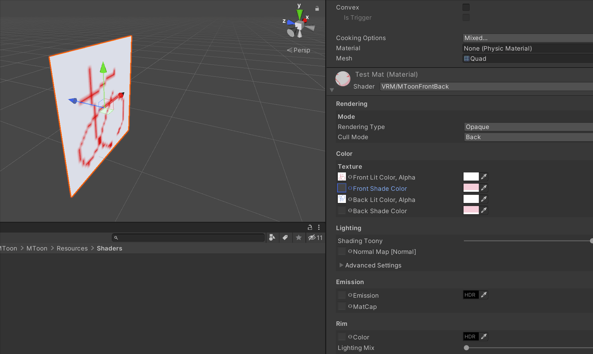

# MToon2Side
A double-sided shader based on [MToon][1].

一个基于[MToon][1]的双面shader。

# Why need? 为什么需要此shader？
Because objects such as skirts and capes often don't want the same pattern on both sides, a shader is needed to solve this problem.

因为裙子和披风等物件往往不希望两边是一样的图案，为此需要一种shader来解决。

# Limit 限制
Since VRM itself cannot carry shaders, it must be used with AssetBundle. For example, after modifying the model in unity, use the VSF SDK to export it or use the VRC SDK to upload it, but do not directly export it for VRM use.

由于VRM本身不能携带shader，所以必须跟随AssetBundle来使用。例如，在Unity中修改模型后使用VSF SDK导出或者是使用VRC SDK上传，但是不要直接导出VRM使用。

# How to use
1. Download [UniVRM][2] and import unity
2. Download MToon2Side.unitypackage in [releases][3] and import unity
3. Create a new material and select VRM/MToonFrontBack
4. Replace the material of the part of the model that needs two sides with a new material
5. Use tools such as VSF SDK or VRC SDK to export models (cannot export .vrm)

# 如何使用
1. 下载[UniVRM][2]并导入Unity
2. 在[releases][3]中下载MToon2Side.unitypackage文件并导入Unity
3. 新建材质并选择VRM/MToonFrontBack
4. 将模型中需要双面的部分的材质替换为新材质
5. 使用VSF SDK或者是VRC SDK等使用AssetBundle形式的工具导出模型（不能导出 .vrm）

[1]:https://github.com/Santarh/MToon
[2]:https://github.com/Santarh/UniVRM
[3]:https://github.com/xiaoye97/MToon2Side/releases